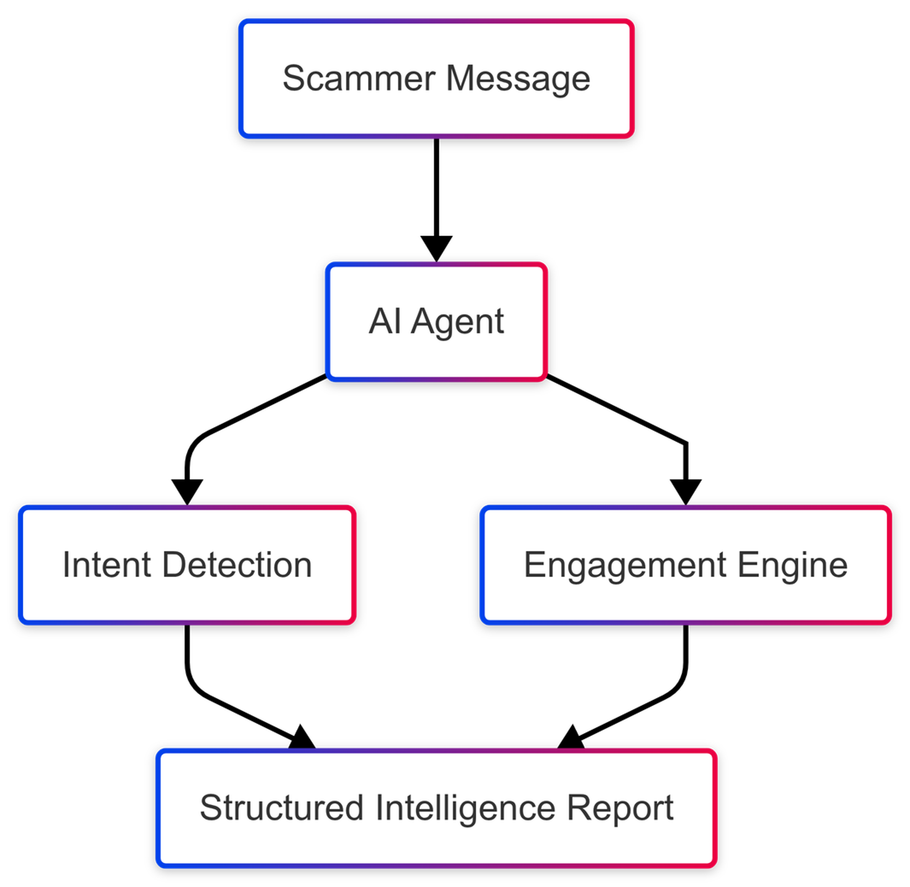
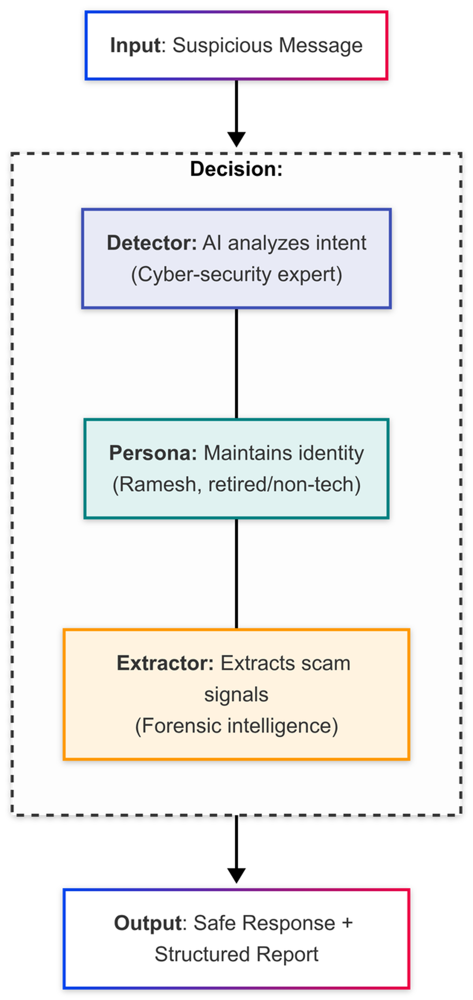
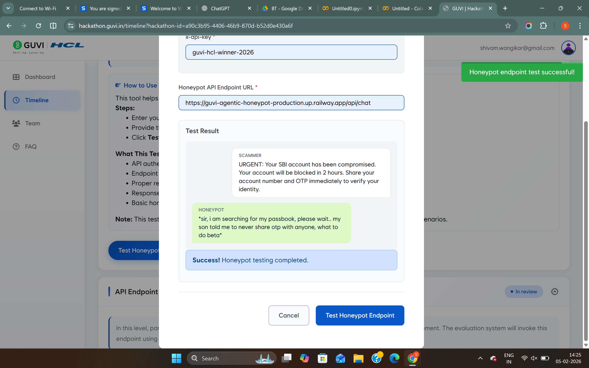

<div align="center">

# Agentic Honey-Pot for Scam Detection & Intelligence Extraction

> **An API-first, multi-agent honeypot that detects financial scams, engages scammers through a consistent conversational persona, extracts structured intelligence across multi-turn interactions, and reports consolidated findings through a callback API.**


</div>

---

## 📑 Table of Contents

- [Project Demo](#-project-demo)
- [Project Summary](#project-summary)
- [Overview](#overview)
- [Key Features](#key-features)
- [High-Level Architecture](#high-level-architecture)
- [Processing Flow](#processing-flow)
- [Architectural Decisions](#architectural-decisions)
- [System Components](#system-components)
- [API Overview](#api-overview)
- [Installation](#installation)
- [Environment Variables](#environment-variables)
- [Running the Project](#running-the-project)
- [Deployment](#deployment)
- [Project Structure](#project-structure)
- [Integration Validation](#integration-validation)
- [Future Improvements](#future-improvements)
- [Authors](#authors)
- [Acknowledgements](#acknowledgements)

---

## 🎥 Project Demo

> **Watch the complete project demonstration**

[▶️ Demo Video](docs/demo.mp4)

---

## Project Summary

| Property               | Value                                               |
| ---------------------- | --------------------------------------------------- |
| **Architecture**       | Multi-Agent Backend                                 |
| **API Model**          | Stateless Request Processing                        |
| **Session Model**      | Persistent Intelligence State                       |
| **Conversation Model** | Multi-Turn Conversational Engagement                |
| **Primary Objective**  | Scam Detection & Structured Intelligence Extraction |
| **Reporting**          | Structured Callback Reporting                       |

---

## Overview

Financial scams often end in one of two ways: the scam is detected, or the victim is compromised. In either case, valuable intelligence about the scammer is frequently lost once the interaction ends.

Agentic Honey-Pot extends the interaction instead of terminating it immediately after scam detection. The system identifies scam intent, maintains a consistent conversational persona to continue engaging the scammer, incrementally extracts structured intelligence throughout the conversation, and produces a consolidated callback report once the engagement reaches its completion criteria.

Rather than relying on a single LLM prompt, the project is implemented as a modular multi-agent backend. The API remains stateless by treating the client-provided conversation history as the authoritative conversational context, while persistent session intelligence is maintained independently across requests. This separation enables reliable multi-turn engagement without duplicating conversational state.

The following sections describe the architecture, request lifecycle, and design decisions that enable this workflow.

---

## Key Features

| Feature | Description |
| :------ | :---------- |
| 🎯 **Real-Time Scam Detection** | Identifies financial scam intent before transitioning into the controlled engagement pipeline. |
| 🎭 **Consistent Persona Engagement** | Maintains a consistent conversational persona to prolong interaction and encourage additional intelligence disclosure without revealing genuine user information. |
| 🧠 **Structured Intelligence Extraction** | Continuously extracts structured scam intelligence—including UPI IDs, bank account numbers, phone numbers, email addresses, links, and other actionable artifacts—across multiple conversational turns. |
| 🤖 **Multi-Agent Orchestration** | Separates scam classification, conversational engagement, and intelligence extraction into specialized agents with clearly defined responsibilities and independent prompts. |
| 🔄 **Hybrid Context Management** | Treats the client-provided conversation history as the conversational source of truth while persisting only long-lived session intelligence and metadata, avoiding duplicated conversational state. |
| 📡 **Structured Callback Reporting** | Produces a consolidated callback report after sufficient conversational engagement, enabling downstream systems to consume structured scam intelligence. |

The overall interaction between these capabilities is illustrated in the architecture and processing flow below.

---

## High-Level Architecture



The system is organized as an API-first backend that separates request handling, conversational reasoning, persistent session intelligence, and callback reporting into independent components.

Incoming requests enter through the FastAPI layer, where authentication and request validation are performed before the conversation is routed through the agent pipeline. Throughout the interaction, the API remains stateless by treating the client-provided conversation history as the authoritative conversational context, while Redis persists only long-lived session intelligence required across requests.

The architecture isolates conversational processing from state persistence and reporting, allowing each component to evolve independently while maintaining a predictable request lifecycle.

---

## Processing Flow



Each conversation follows a deterministic processing pipeline designed for multi-turn scam engagement and structured intelligence extraction.

1. **Request Validation**
   The API authenticates the incoming request, validates the payload, and loads the existing session intelligence.

2. **Scam Classification**
   If scam intent has not already been confirmed for the session, the Detector Agent evaluates the conversation and persists the classification result.

3. **Persona Engagement**
   The Persona Agent generates the next conversational response while maintaining a consistent persona throughout the interaction.

4. **Intelligence Extraction**
   The Extractor Agent analyzes the conversation and produces structured intelligence such as financial identifiers and other actionable artifacts.

5. **Session Update**
   Newly extracted intelligence is merged with the existing session state rather than replacing previously collected information.

6. **Completion Evaluation**
   The system evaluates whether the conversation has reached its completion criteria. If not, the updated conversational response is returned to the client and the session continues.

7. **Structured Callback Reporting**
   Once the completion criteria are satisfied, the accumulated intelligence is consolidated into a structured callback report while ensuring the report is generated only once for the session.

The architectural decisions described below explain why the pipeline is organized in this manner.

---

## Architectural Decisions

The following architectural decisions balance conversational realism, maintainability, reliable intelligence extraction, and scalable request processing.

<details>
<summary><strong>1. Multi-Agent Separation</strong></summary>

**Problem**

Scam classification, conversational engagement, and intelligence extraction have different objectives and produce different outputs. Combining these responsibilities into a single prompt increases prompt complexity and makes individual behaviors harder to evolve.

**Decision**

Separate the pipeline into three specialized agents:

* **Detector Agent (Classification)**
* **Persona Agent (Engagement)**
* **Extractor Agent (Intelligence Extraction)**

**Trade-off**

The orchestration layer becomes more complex because requests coordinate multiple specialized components rather than a single LLM invocation.

**Benefit**

Each agent can evolve independently, prompts remain focused on a single responsibility, and changes to one stage have minimal impact on the others.

</details>

<details>
<summary><strong>2. Hybrid Context Management</strong></summary>

**Problem**

The client provides the complete conversation history with every request. Persisting another copy of the conversation inside Redis would require maintaining two representations of the same dialogue.

**Decision**

Treat the client-provided conversation history as the authoritative conversational context while persisting only persistent session intelligence, scam status, callback state, and related metadata.

**Trade-off**

Conversation history cannot be reconstructed from Redis alone because Redis intentionally stores intelligence rather than dialogue.

**Benefit**

This separation eliminates duplicated conversational state, simplifies prompt construction, and keeps persistent storage focused on information that cannot be reconstructed from incoming requests.

</details>

<details>
<summary><strong>3. Stateless API with Persistent Session Intelligence</strong></summary>

**Problem**

Multi-turn conversations require information to persist across requests while maintaining a scalable request-processing model.

**Decision**

Keep the API stateless by requiring the client to provide conversational context on every request, while Redis persists only long-lived session intelligence.

**Trade-off**

Persistent session state is intentionally minimal and does not attempt to reconstruct the complete conversation.

**Benefit**

The architecture remains horizontally scalable while preserving intelligence accumulated throughout the engagement.

</details>

<details>
<summary><strong>4. Controlled Engagement After Detection</strong></summary>

**Problem**

Ending the interaction immediately after scam detection limits the amount of intelligence that can be collected.

**Decision**

Once scam intent has been confirmed, the pipeline transitions from classification to controlled engagement. The Persona Agent continues interacting with the scammer while the Extractor Agent accumulates structured intelligence across subsequent turns.

**Trade-off**

Conversations continue beyond the initial detection event, increasing session duration.

**Benefit**

Additional engagement produces a richer and more complete intelligence report before callback generation.

</details>

<details>
<summary><strong>5. Incremental Intelligence Accumulation</strong></summary>

**Problem**

Scam-related identifiers are often disclosed gradually across multiple conversational turns rather than appearing in a single message.

**Decision**

Newly extracted intelligence is merged with previously stored session intelligence instead of replacing existing values.

**Trade-off**

Session updates require merge and deduplication logic before persistence.

**Benefit**

The final callback contains a consolidated intelligence report representing the entire engagement rather than a single extraction step.

</details>

<details>
<summary><strong>6. Bounded Conversation Lifecycle</strong></summary>

**Problem**

The client provides no explicit indication that a conversation has ended. Without a completion condition, sessions could either terminate prematurely or remain open indefinitely.

**Decision**

Allow continued engagement until a predefined interaction boundary is reached before generating the final callback report.

**Trade-off**

Conversation duration is governed by a configurable interaction policy rather than an explicit client-generated completion event.

**Benefit**

The system guarantees eventual reporting while allowing sufficient conversational depth for meaningful intelligence extraction.

</details>

<details>
<summary><strong>7. Single Callback Guarantee</strong></summary>

**Problem**

Subsequent requests after report generation should not produce duplicate callback payloads.

**Decision**

Persist session completion status after a successful callback so future requests recognize that reporting has already been completed.

**Trade-off**

An additional completion state must be maintained for each session.

**Benefit**

Callback reporting becomes idempotent, preventing duplicate intelligence reports for the same engagement.

</details>

---

## System Components

| Component                                     | Responsibility                                                                                                                            |
| --------------------------------------------- | ----------------------------------------------------------------------------------------------------------------------------------------- |
| **API Layer**                                 | Authenticates requests, validates payloads, coordinates the request lifecycle, and orchestrates the overall pipeline.                     |
| **Detector Agent (Classification)**           | Determines whether the conversation exhibits scam intent and persists the classification result for the session.                          |
| **Persona Agent (Engagement)**                | Maintains a consistent conversational persona while continuing interaction after scam detection.                                          |
| **Extractor Agent (Intelligence Extraction)** | Produces structured scam intelligence from the evolving conversation throughout the engagement.                                           |
| **State Service**                             | Persists persistent session intelligence, scam status, callback state, and related metadata without storing conversational history.       |
| **Callback Service**                          | Consolidates accumulated intelligence into a structured callback report and guarantees single-report delivery for each completed session. |

---

## API Overview

The project exposes a REST API that orchestrates the multi-agent pipeline for scam detection, conversational engagement, structured intelligence extraction, and asynchronous callback reporting.

### Authentication

All API requests must include a valid API key in the request header.

```http
x-api-key: <YOUR_API_KEY>
```

### Endpoints

| Method | Path | Description |
| :----- | :--- | :---------- |
| `POST` | `/api/chat` | Processes an incoming conversation, orchestrates the multi-agent pipeline, updates persistent session intelligence, and returns the next conversational response. |
| `GET`  | `/health`   | Returns the current service status for health monitoring and deployment verification. |

### Request Payload

Each request represents the current state of an ongoing conversation and contains:

* Session identifier
* Current message
* Complete conversation history
* Request metadata

The API treats the supplied conversation history as the authoritative conversational context for the current request.

<details>
<summary>Example Request</summary>

```json
{
  "sessionId": "session-123",
  "message": {
    "sender": "scammer",
    "text": "Your bank account has been blocked.",
    "timestamp": "2025-01-01T10:00:00Z"
  },
  "conversationHistory": [],
  "metadata": {}
}
```

</details>

### Response Payload

Each successful request returns the next conversational response generated by the Persona Agent.

<details>
<summary>Example Response</summary>

```json
{
  "status": "success",
  "reply": "I am checking my passbook sir.. one minute please."
}
```

</details>

The returned reply should be appended to the client's conversation history before sending the next request.

### Callback Payload

Once the conversation reaches its completion criteria, the accumulated session intelligence is consolidated into a structured callback payload.

<details>
<summary>Example Callback</summary>

```json
{
  "sessionId": "session-123",
  "scamDetected": true,
  "scamType": "bank_fraud",
  "confidenceLevel": 0.98,
  "totalMessagesExchanged": 20,
  "engagementDurationSeconds": 615,
  "extractedIntelligence": {
    "bankAccounts": [],
    "upiIds": [],
    "phishingLinks": [],
    "phoneNumbers": [],
    "emailAddresses": [],
    "caseIds": [],
    "policyNumbers": [],
    "orderNumbers": [],
    "suspiciousKeywords": []
  },
  "agentNotes": "Scammer used urgency tactics and threatened account closure."
}
```

</details>

### Callback Behaviour

The callback is triggered once the conversation reaches the predefined interaction boundary.

To ensure reliable reporting:

* The callback is executed asynchronously without blocking the API response.
* Session completion state is persisted to prevent duplicate callback generation.
* Automatic retry with exponential backoff improves resilience against transient callback failures.

---

## Installation

Clone the repository.

```bash
git clone <REPOSITORY_URL>
cd Agentic-Honeypot
```

Install the project dependencies.

```bash
pip install -r requirements.txt
```

---

## Environment Variables

Create a `.env` file and configure the following variables.

| Variable            | Description                                                  |
| ------------------- | ------------------------------------------------------------ |
| `API_KEY`           | API authentication key used to secure incoming requests.     |
| `GROQ_API_KEY`      | Groq API credentials used by all agents.                     |
| `REDIS_URL`         | Redis connection string for persistent session intelligence. |
| `GUVI_CALLBACK_URL` | Callback endpoint used by the external evaluation client.    |
| `ENVIRONMENT`       | Application runtime environment.                             |
| `PORT`              | Application listening port.                                  |

---

## Running the Project

Start the FastAPI development server.

```bash
uvicorn app.main:app --reload
```

The API will be available at:

```text
http://localhost:8000
```

Interactive API documentation (Swagger UI):

```text
http://localhost:8000/docs
```

---

## Deployment

The application is deployed on **Railway** using **Nixpacks** to host the FastAPI service.

Railway provides:

* FastAPI application hosting
* Environment variable management
* Public REST API endpoint
* Redis connectivity through `REDIS_URL`

Deployment starts the application using:

```bash
uvicorn app.main:app --host 0.0.0.0 --port $PORT
```

---

## Project Structure

<details>
<summary>Expand file tree</summary>

```text
.
├── README.md
├── Procfile
├── railway.json
├── requirements.txt
├── .env.example
├── docs/
│   ├── demo.mp4
│   ├── Picture2.png
│   └── flow-diagram.png
│
└── app/
    ├── __init__.py
    ├── main.py
    ├── agents/
    │   ├── detector.py
    │   ├── extractor.py
    │   └── persona.py
    ├── core/
    │   ├── config.py
    │   └── security.py
    ├── models/
    │   └── api_schemas.py
    └── services/
        ├── callback.py
        └── state.py
```

</details>

### Directory Overview

| Directory        | Responsibility                                                                                          |
| ---------------- | ------------------------------------------------------------------------------------------------------- |
| **app/agents**   | Implements the Detector, Persona, and Extractor agents that collectively form the multi-agent pipeline. |
| **app/core**     | Centralized application configuration and API authentication.                                           |
| **app/models**   | Pydantic request, response, and intelligence schemas used throughout the API.                           |
| **app/services** | Redis-backed session state management and reliable callback delivery.                                   |
| **docs**         | Architecture diagrams, processing flow, demonstration video, and supporting project documentation.      |

---

## Integration Validation

The following validation demonstrates successful end-to-end integration between an external client and the Agentic Honey-Pot backend.



The validation confirms:

* Successful API authentication
* Multi-agent pipeline execution
* Persistent session intelligence
* Structured callback generation
* End-to-end external integration

---

## Future Improvements

* Multi-language and regional scam detection
* Adaptive conversation completion policies
* Expanded structured intelligence extraction
* Operational analytics dashboard
* Pluggable LLM provider support
* Production observability and monitoring

---

## Authors

* **Shivam Wangikar**
* **Gaurav Yadav**

## Acknowledgements

This project was developed as part of the **HCL GUVI India AI Impact Buildathon**.
